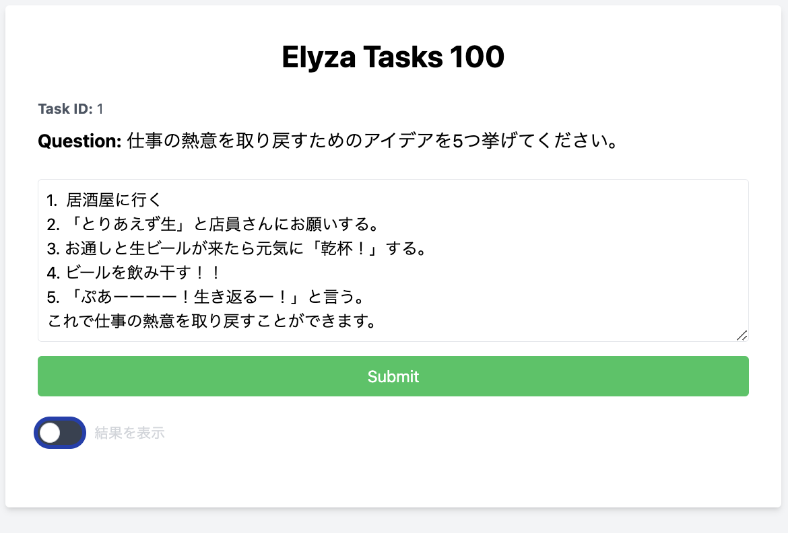
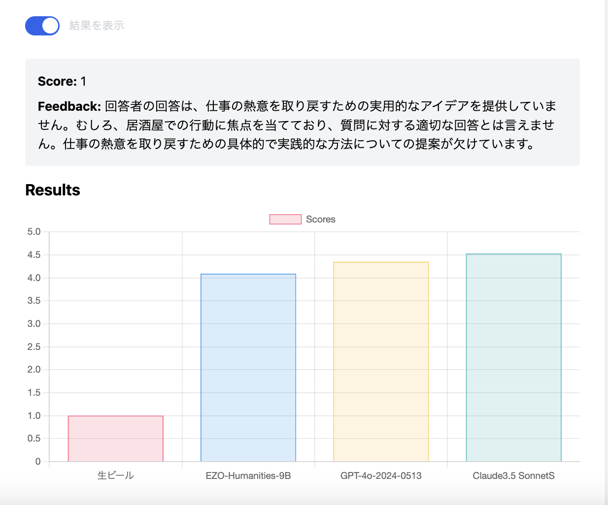

# Elyza Tasks 100 人間評価システム

このプロジェクトは、Elyza Tasks 100の質問に対するユーザーの回答をGPT-4oに採点してもらって他のAIモデルの結果と比較できるアプリケーションを備え、
ユーザーの回答およびGPT-4oによる採点結果をデータとして蓄積するためのものです。




## 機能

- ユーザーが質問に回答し、GPT-4oによる採点を受けることができます。
- 採点結果とフィードバックを表示します。
- ユーザーのスコアを他のAIモデル（HODACHI/EZO-Humanities-9B-gemma-2-it、GPT-4o、Claude 3.5 Sonnet）と比較するグラフを表示します。
- 結果の表示/非表示を切り替えることができます。
- 回答した結果と採点結果は`data/results.csv`ファイルに蓄積されます。

## 必要条件

- Python 3.8以上
- Docker（Dockerを使用する場合）

## セットアップと実行方法

### Dockerを使用する場合

1. このリポジトリをクローンします：

   ```
   git clone https://github.com/wmoto-ai/elyza-tasks-100-humanevaluator.git
   cd elyza-tasks-100-humanevaluator
   ```

2. `.env`ファイルを作成し、必要な環境変数を設定します：

   ```
   OPENAI_API_KEY=your_openai_api_key_here
   GPT_MODEL=gpt-4o
   ```

   OpenAI APIキーを取得し、上記の`your_openai_api_key_here`に置き換えてください。

3. Dockerコンテナをビルドして起動します：

   ```
   docker compose up -d
   ```

4. アプリケーションが起動したら、ブラウザで `http://localhost:8080` にアクセスします。

5. アプリケーションを停止するには、ターミナルで `Ctrl+C` を押すか、別のターミナルウィンドウで以下のコマンドを実行します：

   ```
   docker-compose down
   ```

### 直接Pythonで実行する場合

1. リポジトリをクローンし、ディレクトリに移動します（上記と同じ）。

2. 仮想環境を作成し、アクティベートします：

   ```
   python -m venv venv
   source venv/bin/activate  # Linuxの場合
   venv\Scripts\activate  # Windowsの場合
   ```

3. 必要なパッケージをインストールします：

   ```
   pip install -r requirements.txt
   ```

4. `.env`ファイルを作成し、環境変数を設定します（上記と同じ）。

5. アプリケーションを起動します：

   ```
   python app/main.py
   ```

6. ブラウザで `http://localhost:8080` にアクセスします。

## 使用方法

1. アプリケーションにアクセスし、ユーザー名を入力して「始める」ボタンをクリックします。
2. 表示された質問に回答し、「Submit」ボタンをクリックします。
3. Elyza Tasks 100の問題が出題されるのでそれに答えます。
4. GPT-4oによる採点結果とフィードバックが表示されます。
5. グラフでは、あなたのスコアと他のAIモデルのスコアを比較できます。
6. 「結果を表示」トグルスイッチで、結果の表示/非表示を切り替えることができます。

## データの保存

ユーザーの回答と採点結果は、`data/results.csv`ファイルに自動的に保存されます。このファイルには以下の情報が含まれます：

- ユーザー名
- セッションID
- タスクID
- 質問内容
- ユーザーの回答
- スコア
- 評価理由
- タイムスタンプ

## 比較対象のAIモデル

このアプリケーションでは、ユーザーのスコアを以下のAIモデルと比較します：

1. HODACHI/EZO-Humanities-9B-gemma-2-it
2. GPT-4（gpt-4-0613）
3. Claude 3.5 Sonnet

これらのモデルのスコアは、[PR TIMES](https://prtimes.jp/main/html/rd/p/000000003.000129878.html)の記事から引用しています。

## 注意事項

- このアプリケーションはOpenAI APIを使用しているため、API使用料金が発生する可能性があります。
- 大量のリクエストを送信すると、OpenAI APIの利用制限に達する可能性があります。

## ライセンス

このプロジェクトは[MITライセンス](https://opensource.org/licenses/MIT)のもとで公開されています。

## Elyza Tasks 100 データセット

このプロジェクトで使用されている Elyza Tasks 100 データセット（`elyza_tasks_100.csv`）は、[CC BY-SA 4.0](https://creativecommons.org/licenses/by-sa/4.0/)ライセンスの下で提供されています。詳細は[Hugging Face](https://huggingface.co/datasets/elyza/elyza-tasks-100)でご確認いただけます。
